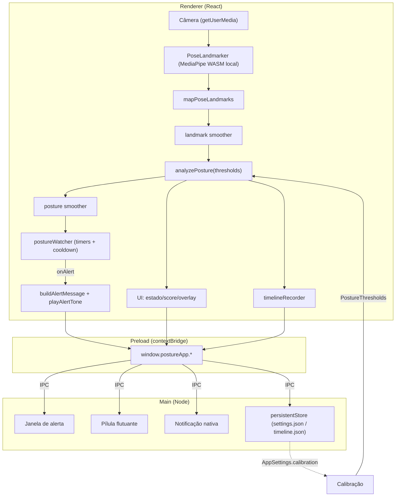

# Arquitetura

PosturaCerta é um app Electron com três processos clássicos: **main** (Node), **preload** (ponte) e **renderer** (React). Toda a inteligência de postura roda no renderer; o main cuida de janelas, persistência em disco, notificações nativas e atualização automática.

## Modelo de processos

### Main (`src/main/`)

Processo Node com acesso ao SO. Responsável por:

- Criar e coordenar as janelas (`src/main/index.ts`).
- Registrar os handlers de IPC (`registerIpcHandlers`).
- Persistir settings e timeline em disco (`persistentStore.ts`).
- Mostrar notificações nativas (`Notification`).
- Atualização automática via `electron-updater`.
- Tratar permissões de câmera (`setPermissionRequestHandler` / `setPermissionCheckHandler`).

Todas as janelas usam o mesmo hardening:

```ts
webPreferences: {
  preload: PRELOAD_PATH,
  contextIsolation: true,
  nodeIntegration: false,
  sandbox: true,
  backgroundThrottling: false,
}
```

`backgroundThrottling: false` é importante porque o pipeline precisa continuar rodando mesmo com a janela em segundo plano.

No Linux, o main liga o portal PipeWire logo na inicialização para permitir compartilhar a webcam:

```ts
if (process.platform === 'linux') {
  app.commandLine.appendSwitch('enable-features', 'PipeWireCamera,WebRTCPipeWireCapturer');
}
```

Há lock de instância única (`requestSingleInstanceLock`); abrir o app de novo apenas restaura a janela existente.

### Preload (`src/preload/index.ts`)

Roda em contexto isolado e expõe uma única API via `contextBridge.exposeInMainWorld('postureApp', ...)`. O renderer nunca toca em `ipcRenderer` direto; tudo passa por `window.postureApp`.

### Renderer (`src/renderer/src/`)

App React 19. Contém as telas, o design system e a camada `lib/*` com toda a lógica pura (pose, postura, alertas, settings, timeline, tema, mídia). É aqui que a câmera é aberta e o MediaPipe processa cada frame.

## Janelas

| Janela | Arquivo | Papel |
|--------|---------|-------|
| Principal | `index.ts` (`createWindow`) | Janela 1120x760, frame oculto. Carrega o app React completo. Ao fechar com o flutuante ligado, vai para segundo plano em vez de encerrar. |
| Mini / PiP | `index.ts` (`createMiniWindow`) | Janela pequena (320x240) `alwaysOnTop`, `skipTaskbar`, visível em todos os workspaces. Carrega o renderer com hash `#mini`. Usada para acompanhar a câmera num canto da tela. |
| Pílula flutuante | `postureFloatingWindow.ts` | Janela minúscula sem borda (252x60), transparente, click-through parcial, sempre no topo. Mostra o estado atual (cor + label + score) quando o app está em segundo plano. HTML inline via `data:`/string, sem rede. |
| Alerta de postura | `postureAlertWindow.ts` | Toast on-screen que aparece quando a postura passa do limite por tempo suficiente. |

A troca entre janela principal e segundo plano (flutuante) acontece em `sendToBackground` / `restoreMainWindow`. Há um atraso de handoff de câmera (`CAMERA_HANDOFF_DELAY_MS = 250`) ao entrar no modo mini para liberar o device antes de a nova janela abri-lo.

## Superfície de IPC (`window.postureApp`)

Tudo que o renderer pode pedir ao main está tipado no preload. Resumo por área:

### Alertas e notificações

| Método | Direção | Descrição |
|--------|---------|-----------|
| `showAlert(level, message)` | send | Abre a janela de alerta de postura. |
| `hideAlert()` | send | Fecha a janela de alerta. |
| `notify(level, message)` | send | Dispara uma notificação nativa do SO. |

### Janela flutuante / mini / segundo plano

| Método | Direção | Descrição |
|--------|---------|-----------|
| `enterMini()` / `exitMini()` | send | Entra/sai do modo mini (PiP). |
| `onMiniActive(cb)` | on | Assina o estado ativo/inativo do modo mini. Retorna unsubscribe. |
| `updateFloating({ state, label, score })` | send | Atualiza o conteúdo da pílula flutuante. |
| `setAnalysisActive(active)` | send | Informa ao main se a análise está rodando. |
| `setFocusConfig({ enabled, opacity })` | send | Liga/desliga o flutuante e ajusta a opacidade. |
| `restoreFromFloating()` | send | Restaura a janela principal a partir do flutuante. |
| `showFloating()` | send | Manda o app para segundo plano mostrando o flutuante. |
| `openFloatingMenu()` | send | Abre o menu de contexto do flutuante (Restaurar / Sair). |

### App e janela

| Método | Direção | Descrição |
|--------|---------|-----------|
| `quit()` | send | Encerra o app. |
| `getAppInfo()` | invoke | Retorna `{ name, version, platform }`. |
| `installUpdate()` | invoke | Reinicia instalando o update baixado. |
| `onUpdateStatus(cb)` | on | Assina o status do updater. Retorna unsubscribe. |
| `window.minimize()` / `toggleMaximize()` / `close()` | send | Controles da titlebar custom. |
| `platform`, `versions` | valor | Plataforma e versões de Electron/Chrome. |

### Storage

| Método | Direção | Descrição |
|--------|---------|-----------|
| `storage.readSettings()` / `writeSettings(data)` | invoke | Lê/grava `settings.json` no disco do app. |
| `storage.readTimeline()` / `writeTimeline(data)` | invoke | Lê/grava `timeline.json` no disco do app. |

## Persistência

Dois caminhos complementares, ambos sem PII:

1. **`persistentStore` (disco, via main).** `readJsonFile` / `writeJsonFile` gravam `settings.json` e `timeline.json` na pasta de dados do app. As escritas passam por uma fila serializada (`queueWrite`) para evitar corrida entre gravações concorrentes do mesmo arquivo.
2. **localStorage (fallback no renderer).** `src/renderer/src/lib/settings/storage.ts` grava as settings na chave `postura-certa.settings.v1` e também chama o bridge. `loadSettingsAsync` lê do disco quando disponível e cai para o localStorage se o bridge falhar.

`parseSettings` valida cada campo de `AppSettings` contra valores conhecidos e devolve `defaultSettings` quando algo está ausente ou inválido, então o esquema é tolerante a versões antigas. Há inclusive uma migração silenciosa: no Linux, `cameraMode: 'continuous'` vira `'shared'` por causa do acesso exclusivo v4l2.

O tema é lido de forma síncrona em `main.tsx` antes do primeiro paint, evitando flash de cor errada:

```ts
applyTheme(readPersistedTheme()); // lê localStorage; default 'dark'
```

## Pipeline de pose (MediaPipe)

A camada `src/renderer/src/lib/pose/` encapsula o MediaPipe:

- `createPoseLandmarker()` instancia o `PoseLandmarker` do `@mediapipe/tasks-vision` com WASM local (`public/mediapipe/wasm/`) e o modelo `public/models/pose_landmarker_lite.task`. Nenhum download remoto.
- `mapPoseLandmarks(raw)` converte os landmarks brutos do MediaPipe para o formato interno `PoseLandmark[]` com nomes semânticos (`nose`, `leftShoulder`, `rightShoulder`, `leftHip`, etc.).
- `poseOverlay.ts` desenha os pontos/linhas sobre o vídeo quando o overlay está ligado.

## Pipeline de postura

Cadeia `analyzePosture -> smoother -> watcher -> alerts`:

1. **`analyzePosture(landmarks, thresholds)`** (`lib/posture/analyzePosture.ts`) recebe os landmarks de um frame e devolve um `PostureAnalysis` com `state` (`good` | `warning` | `bad` | `away` | ...), `score`, `reasons` (`head-forward`, `shoulder-tilt`, `neck-tilt`, `neck-rotation`, `slouch`, `head-down`, `low-confidence`) e `metrics`. Os `thresholds` vêm da calibração personalizada quando existe.
2. **Smoother** (`createPostureSmoother`, janela padrão de 8 frames) suaviza o estado para evitar oscilação frame a frame. Há também `createLandmarkSmoother` para suavizar os pontos antes da análise.
3. **Watcher** (`createPostureWatcher`) acumula tempo nos estados ruins. Quando `warning`/`bad` persiste além do limite configurado (`warningThresholdMs`/`badThresholdMs`), dispara `onAlert`. Tem cooldown (padrão 120s) e histerese de "good" (padrão 1500ms) para não resetar o contador por blips.
4. **Alerts** (`lib/alerts/`) traduzem o evento em mensagem (`buildAlertMessage`) e tocam o som (`playAlertTone`). A mensagem vai para a janela de alerta e/ou notificação nativa via `window.postureApp`.

A calibração (`lib/posture/createPersonalizedThresholds.ts`) coleta amostras durante alguns segundos, calcula a baseline do corpo da pessoa e gera os `PostureThresholds` salvos em `AppSettings.calibration`.

A linha do tempo (`lib/timeline/`) grava os estados ao longo do dia (`createTimelineRecorder`), agrega estatísticas (`stats.ts`) e exporta CSV (`exportCsv.ts`), tudo local.

## Diagrama de fluxo


</content>
